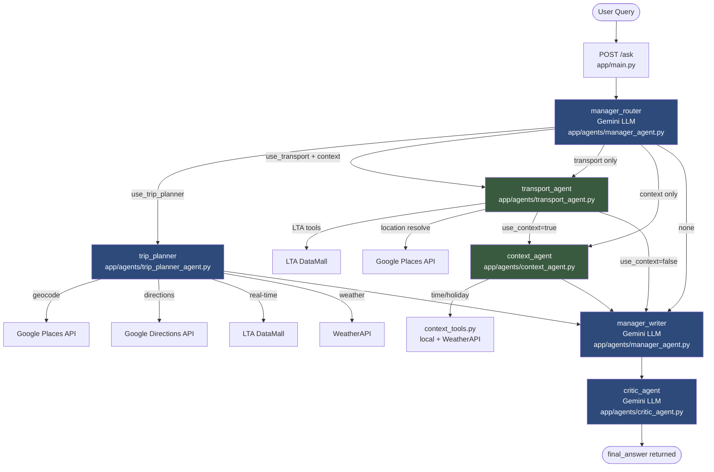

# CommuteGenie Singapore — Multi-Agent Architecture

> A detailed technical reference for developers, evaluators, and researchers.

---

## 1. Executive Summary

CommuteGenie Singapore is a production-ready multi-agent AI system that answers natural-language transportation questions for Singapore commuters. A single user query can trigger a pipeline spanning up to six specialised agents, multiple real-time APIs, LLM calls to Google Gemini, and a scoring algorithm — all coordinated through a **LangGraph StateGraph** and served over a **FastAPI** REST backend.

The system is distinguished by three design choices:

1. **LLM-driven dynamic routing** — the Manager Router uses Gemini to classify every query and decides at runtime which combination of worker agents to invoke. No hard-coded rules determine the path.
2. **Selective real-time data fetching** — the Trip Planner inspects the actual route steps returned by Google Directions before deciding which LTA/weather signals to pull, minimising unnecessary API calls.
3. **Additive penalty scoring** — routes are ranked by effective travel time after applying data-driven penalty minutes for traffic, train disruptions, bus wait, weather, and transfers, giving users a grounded recommendation rather than a raw API output.

---

## 2. High-Level Architecture

```
┌─────────────────────────────────────────────────────────────────────┐
│                          CLIENT LAYER                               │
│                                                                     │
│   React / Vite SPA          Streamlit Demo UI                       │
│   (frontend/src/)           (frontend/streamlit_app.py)             │
│        │                          │                                 │
│        └──────────┬───────────────┘                                 │
│                   │  HTTP POST /ask                                  │
└───────────────────┼─────────────────────────────────────────────────┘
                    │
┌───────────────────▼─────────────────────────────────────────────────┐
│                       FASTAPI BACKEND                               │
│                       (app/main.py)                                 │
│                                                                     │
│   POST /ask  ──►  commutegenie_graph.invoke(initial_state)          │
└───────────────────┬─────────────────────────────────────────────────┘
                    │
┌───────────────────▼─────────────────────────────────────────────────┐
│                    LANGGRAPH STATE MACHINE                          │
│                       (app/graph.py)                                │
│                                                                     │
│  ┌──────────────┐    conditional    ┌───────────────┐               │
│  │manager_router│ ──────────────── ►│  trip_planner │               │
│  └──────┬───────┘                  └───────┬───────┘               │
│         │                                  │                        │
│         ├──► transport_agent               │                        │
│         │         │                        │                        │
│         │    ──► context_agent             │                        │
│         │              │                   │                        │
│         └──────────────┴───────────────────┘                        │
│                         │                                           │
│                  manager_writer                                     │
│                         │                                           │
│                   critic_agent ──► END                              │
└─────────────────────────────────────────────────────────────────────┘
                    │
┌───────────────────▼─────────────────────────────────────────────────┐
│                     EXTERNAL SERVICES                               │
│                                                                     │
│   Google Gemini       LTA DataMall       Google Maps Platform       │
│   (LLM reasoning)     (transit data)     (Places + Directions)      │
│                                                                     │
│                        WeatherAPI                                   │
│                    (current conditions)                             │
└─────────────────────────────────────────────────────────────────────┘
```

---

## 3. Multi-Agent Architecture

The system implements a **Manager–Worker–Critic** pattern on a LangGraph `StateGraph`. All agents are plain Python functions that accept and return a single shared `AgentState` TypedDict. LangGraph threads this state through the graph — no message passing, no queues.

### 3.1 Shared State (`app/state.py`)

```python
class AgentState(TypedDict, total=False):
    user_id: str
    question: str

    manager_plan: Dict[str, Any]      # router's JSON routing decision
    transport_result: Dict[str, Any]  # LTA tool outputs
    context_result: Dict[str, Any]    # time / holiday / weather
    trip_result: Dict[str, Any]       # geocode + route + score payload
    draft_answer: str                 # writer's draft text
    critic_result: Dict[str, Any]     # {approved, feedback}
    final_answer: str                 # response returned to user

    used_agents: List[str]            # accumulated list for observability
    trace: Dict[str, Any]             # per-node debug data
    revision_count: int               # initialised to 0; not currently used
```

`total=False` means every field is optional — nodes only write the fields they own and read fields set by earlier nodes.

### 3.2 Graph Definition (`app/graph.py`)

```python
graph.set_entry_point("manager_router")

graph.add_conditional_edges("manager_router", route_after_manager, {
    "trip_planner":  "trip_planner",
    "transport":     "transport_agent",
    "transport_only":"transport_agent",
    "context_only":  "context_agent",
    "write":         "manager_writer",
})

graph.add_edge("trip_planner",     "manager_writer")
graph.add_conditional_edges("transport_agent", route_after_transport, {
    "context": "context_agent",
    "write":   "manager_writer",
})
graph.add_edge("context_agent",    "manager_writer")
graph.add_edge("manager_writer",   "critic_agent")
graph.add_edge("critic_agent",     END)
```

Every query follows exactly one path through the graph. The `critic_agent` is always the last node before `END` — it never loops back (see Limitations).

---

## 4. Agent Responsibilities

| Agent | File | LLM? | Responsibility |
|---|---|---|---|
| **Manager Router** | `app/agents/manager_agent.py` | Yes | Classifies the query and emits a JSON routing plan: `{use_trip_planner, use_transport, use_context, context_needs, intent_summary}`. Falls back to full agent run on parse failure. |
| **Trip Planner** | `app/agents/trip_planner_agent.py` | Yes (x2) | End-to-end pipeline: LLM extracts O/D → geocode → directions → classify errors → selective real-time fetch → score routes → LLM writes draft. |
| **Transport Agent** | `app/agents/transport_agent.py` | No | Keyword/regex-based selection of LTA tools. Handles bus arrivals, bus stop search, nearest stops, train alerts, traffic incidents, taxi availability, EV charging. |
| **Context Agent** | `app/agents/context_agent.py` | No | Fetches only the context types requested by the router (`time`, `holiday`, `weather`). Defaults to all three if the request is empty or invalid. |
| **Manager Writer** | `app/agents/manager_agent.py` | Yes (conditional) | If `trip_result` + `draft_answer` exist (trip planner path), passes through without an LLM call. Otherwise calls Gemini to synthesise transport + context outputs. |
| **Critic Agent** | `app/agents/critic_agent.py` | Yes | Reviews the draft against reference data (trip_result or transport/context outputs). Sets `final_answer` to the draft if approved, or appends the critic note if not. |

### Manager Router — Routing Logic

The router receives the user question and emits a JSON plan. Routing rules (from `ROUTER_SYSTEM_PROMPT`):

| Condition | Flags set |
|---|---|
| User wants to travel from A to B | `use_trip_planner: true` |
| Specific LTA lookup (bus stop, MRT alerts, etc.) | `use_transport: true` |
| Time/weather/holiday context needed | `use_context: true` |
| Multi-intent (e.g. rain + MRT disruptions?) | `use_transport: true, use_context: true` |
| Parse failure | Fallback: `use_transport: true, use_context: true` (all three context types) |

`use_trip_planner` takes priority over all other flags — if true, `transport_agent` and `context_agent` are skipped entirely.

### Trip Planner — 8-Step Internal Pipeline

All eight steps run inside a single LangGraph node to keep graph topology minimal:

```
Step 1  │  LLM parses origin + destination from the question
Step 2  │  Geocode origin via Google Places API (searchText, Singapore-biased)
Step 3  │  Geocode destination via Google Places API
Step 4  │  Fetch driving + transit routes via Google Directions API
Step 5  │  Classify error type: ok / api_denied / no_route / all_failed / api_error
Step 6  │  decide_realtime_needs() — inspect route steps to choose which signals to fetch
Step 7  │  fetch_realtime_context() — call only the needed LTA / WeatherAPI tools
Step 8a │  score_routes() — rank by effective minutes (raw + penalties)
Step 8b │  build_trip_result() — assemble final payload
Step 9  │  LLM writes a structured bullet-point draft answer
```

**Scoring penalties (additive minutes to raw duration):**

| Signal | Condition | Penalty |
|---|---|---|
| Traffic incidents | ≥5 incidents | +15 min (driving/taxi) |
| Traffic incidents | 2–4 incidents | +7.5 min (driving/taxi) |
| Train disruption | Status ≠ 1 | +20 min (transit) |
| Bus wait | Nearest stop > 15 min | +5 min (transit) |
| Weather | High impact | +10 min (driving/taxi), +20 min (walking) |
| Weather | Moderate impact | +5 min |
| Weather (transit) | High impact + walking step > 10 min | +10 min |
| Extra transfers | Each additional transit leg | +8 min |

**Fallback when Directions API is unavailable:**

If `classify_route_error` returns `api_denied`, the planner still:
1. Fetches LTA real-time signals (train alerts, taxi, nearest bus stops, time)
2. Constructs a `general_guidance` payload with line-level MRT/taxi/bus knowledge
3. Calls the LLM with `TRIP_PLANNER_FALLBACK_PROMPT` to write a helpful response
4. Never blames the user's locations or says "no route found"

### Transport Agent — Tool Selection

Uses regex and keyword matching on the lowercased question to decide which tools to call. No LLM is involved:

| Keyword pattern | Tool called |
|---|---|
| "bus stop" + "nearest/closest/near me" | `tool_nearest_bus_stops()` |
| "ev/charging" + "nearest/closest/near me" | `tool_nearest_ev_charging_points()` |
| "bus stop" + "find/code/where/lookup" | `tool_bus_stops_search()` |
| "bus" + "next/arrival/eta" | `tool_bus_arrival()` |
| "traffic/accident/incident/jam" | `tool_traffic_incidents()` |
| "train/mrt/disruption/ewl/nsl/dtl/ccl/nel/tel" | `tool_train_alerts()` |
| "taxi/cab" | `tool_taxi_availability()` |
| Location phrase + nearest query | `tool_resolve_location_query()` → Google Places |

If no pattern matches, a generic fallback note is placed in `transport_result`.

---

## 5. End-to-End Query Flow

### Path A — Trip Planning Query

```
User: "I want to go from Orchard Road to Marina Bay Sands"

1. POST /ask  →  app/main.py
   └─ Initialise AgentState: {question, user_id, used_agents:[], trace:{}, revision_count:0}

2. manager_router_node  (app/agents/manager_agent.py)
   └─ LLM call → {use_trip_planner:true, intent_summary:"User wants route Orchard→MBS"}
   └─ state["manager_plan"] set, "manager_router" appended to used_agents

3. route_after_manager()  →  "trip_planner"

4. trip_planner_node  (app/agents/trip_planner_agent.py)
   ├─ LLM: extract "Orchard Road" and "Marina Bay Sands"
   ├─ geocode_location("Orchard Road")  →  Google Places API
   ├─ geocode_location("Marina Bay Sands")  →  Google Places API
   ├─ get_route_options()  →  Google Directions API (driving + transit)
   ├─ classify_route_error()  →  "ok"
   ├─ decide_realtime_needs()  →  {traffic:true, train_alerts:true, bus_stops:true, time:true}
   ├─ fetch_realtime_context()
   │    ├─ tool_traffic_incidents()  →  LTA DataMall
   │    ├─ tool_train_alerts()       →  LTA DataMall
   │    ├─ tool_nearest_bus_stops()  →  LTA DataMall
   │    └─ get_sg_time_context()     →  local (no HTTP)
   ├─ score_routes()  →  ranked list with effective_mins
   ├─ build_trip_result()  →  state["trip_result"]
   └─ LLM: write draft  →  state["draft_answer"]

5. manager_writer_node
   └─ Detects trip_result exists → pass-through (no LLM call)

6. critic_agent_node  (app/agents/critic_agent.py)
   └─ LLM: review draft vs trip_result → {approved:true, feedback:"..."}
   └─ state["final_answer"] = draft_answer

7. /ask returns:
   {answer, approved, used_agents:["manager_router","trip_planner","manager_writer","critic_agent"], trace}
```

### Path B — Transport Lookup Query

```
User: "When is the next bus at stop 83139?"

1. POST /ask → manager_router → {use_transport:true, use_context:false}
2. route_after_manager() → "transport_only" → transport_agent
3. transport_agent_node:
   - "bus" + "next" keyword match → tool_bus_arrival("83139")
   - state["transport_result"] = {bus_arrival: {...services}}
4. route_after_transport() → "write" → manager_writer
5. manager_writer: LLM synthesises transport_result → draft_answer
6. critic_agent: review → final_answer
```

### Path C — Multi-Intent Query

```
User: "Is it raining and are there any MRT disruptions?"

1. manager_router → {use_transport:true, use_context:true, context_needs:["weather","time"]}
2. route_after_manager() → "transport" → transport_agent
3. transport_agent: "mrt"/"disruption" match → tool_train_alerts()
4. route_after_transport() → "context" → context_agent
5. context_agent: fetches weather + time (from context_needs)
6. manager_writer: LLM synthesises both outputs → draft_answer
7. critic_agent: review → final_answer
```

---

## 6. Mermaid Architecture Diagram



---

## 7. Tools and External APIs

### LTA DataMall (`app/tools/lta_client.py`, `app/tools/transit_tools.py`)

The `LTADatamallClient` class handles authentication, retry logic (3 retries, 0.5s backoff, on 429/5xx), and pagination (`get_paged`). A global `lta_client` instance is created at import time; if `LTA_ACCOUNT_KEY` is not set, `lta_client` is `None` and every tool returns a structured error dict.

| Function | Endpoint | Data returned |
|---|---|---|
| `tool_bus_arrival(stop_code, service_no?)` | `v3/BusArrival` | Next 3 ETAs per service (up to 5 services) |
| `tool_bus_stops_search(query)` | `BusStops` (paged, 6h cache) | Up to 5 matching stops by name/road |
| `tool_nearest_bus_stops(n, location?)` | `BusStops` + Haversine | Closest n stops to coordinates |
| `tool_traffic_incidents()` | `TrafficIncidents` (30s cache) | Count + top 5 incidents |
| `tool_train_alerts()` | `TrainServiceAlerts` (30s cache) | Raw alert object + status |
| `tool_taxi_availability()` | `Taxi-Availability` (30s cache) | Count + top 5 taxi positions |
| `tool_nearest_ev_charging_points(n, location?)` | `EVCBatch` (5min cache) | Closest n EV stations with availability |
| `tool_resolve_location_query(phrase)` | — (delegates to Google Places) | lat/lon + name for a text location |

**TTL Cache:** A hand-rolled in-memory `TTLCache` class (not thread-safe) stores results per key with configurable TTL. Real-time data (traffic, train, taxi): 30 seconds. Static data (bus stops): 6 hours. EV stations: 5 minutes.

### Google Maps Platform (`app/tools/google_maps_client.py`)

A `GoogleMapsClient` class wraps two Google Cloud APIs:

**Places API v1** (`places:searchText`):
- POST to `https://places.googleapis.com/v1/places:searchText`
- Singapore bounding box bias (`1.13°–1.47°N, 103.60°–104.10°E`)
- Returns up to 5 results; top result used for geocoding
- Field mask: `id, displayName, formattedAddress, location, types`

**Directions API (REST v1)**:
- GET to `https://maps.googleapis.com/maps/api/directions/json`
- Supports modes: `driving`, `transit`, `walking`, `bicycling`
- `departure_time=now` passed for driving and transit
- Parses legs → steps into a structured summary including transit vehicle type, line name, stop names, transfer count, and per-step duration/distance
- Error types classified: `api_denied`, `no_route`, `location_not_found`, `quota_exceeded`, `api_error`

### WeatherAPI (`app/tools/context_tools.py`)

- GET `https://api.weatherapi.com/v1/current.json?q=Singapore`
- Returns `condition`, `temperature_c`, `humidity`, `wind_kph`
- Impact classified locally: thunderstorm → `high`, rain/drizzle → `moderate`, cloud → `low`, clear → `minimal`
- Configured via env var `OPENWEATHER_API_KEY` (variable name is a historical misnomer — actual provider is WeatherAPI, not OpenWeatherMap)
- Gracefully returns `{condition:"unknown", impact:"unknown", note:"API key not set"}` if key is absent

### Context Tools (`app/tools/context_tools.py`)

| Function | Implementation | Returns |
|---|---|---|
| `get_sg_time_context()` | `datetime.now(Asia/Singapore)` | hour, weekday, is_weekend, is_rush_hour |
| `get_sg_holiday_context()` | `holidays.Singapore` library | date, is_public_holiday, holiday_name |
| `get_current_location_context()` | Returns hardcoded constant | Queensway Shopping Centre coordinates |

---

## 8. Prompting Strategy

All LLM system prompts are centralised in `app/prompts.py`. Temperature is fixed at `0.2` across all calls (via `app/services/llm_service.py`) to favour deterministic, grounded output.

| Prompt | Agent | Strategy |
|---|---|---|
| `ROUTER_SYSTEM_PROMPT` | Manager Router | JSON-only output; explicit rules for each flag; fallback on parse failure |
| `TRIP_PLANNER_WRITER_PROMPT` | Trip Planner Writer | Strict bullet-point structure (5 sections, 8–10 lines); Case A (full data) and Case B (API fallback) templates with example values; prohibits prose, raw data dumps, invented facts |
| `TRIP_PLANNER_FALLBACK_PROMPT` | Trip Planner Fallback | 4-section bullet structure; writes general guidance when Directions API is unavailable |
| `MANAGER_SYSTEM_PROMPT` | Manager Writer | Ground answers in worker outputs only; compare modes, mention disruptions, never invent data |
| `CRITIC_SYSTEM_PROMPT` | Critic Agent | JSON-only output `{approved, feedback}`; checks grounding, contradictions, completeness, invented facts, reasoning quality, route clarity, verbosity |

**JSON extraction pattern:** All LLM calls that expect JSON use a two-stage parser — direct `json.loads()` first, then regex `\{.*\}` extraction with `re.DOTALL`. If both fail, each agent has a safe fallback (router defaults to full agent run; critic defaults to approved=True).

---

## 9. Error Handling and Fallback Logic

| Scenario | Handling |
|---|---|
| LTA key not set | `lta_client` is `None`; every LTA tool returns `{"error": "LTA client not initialized..."}` |
| Google Maps key not set | `get_directions` returns per-mode `api_key_missing` error dict without raising |
| Directions API → REQUEST_DENIED | Classified as `api_denied`; trip planner enters fallback path (general guidance + LTA signals) |
| Directions API → ZERO_RESULTS | Classified as `no_route`; trip planner returns informative error message |
| Location cannot be geocoded | Hard stop at step 2/3; `draft_answer` set to a user-friendly "location not found" message |
| O/D cannot be extracted by LLM | Hard stop at step 1; prompts user to rephrase |
| LLM returns malformed JSON (router) | Regex extraction attempted; if still invalid, fallback plan activates all workers |
| LLM returns malformed JSON (critic) | Regex extraction attempted; if still invalid, `approved=True` fallback applied silently |
| Critic rejects draft | `final_answer` = draft + `"\n\nCritic note: " + feedback` |
| WeatherAPI error | Returns `{condition:"unknown", impact:"unknown", note:str(exc)}`; pipeline continues |
| LTA API HTTP error | `requests` adapter retries 3× on 429/5xx; on final failure returns structured error dict |

---

## 10. Key Files and Their Responsibilities

| File | Purpose |
|---|---|
| `app/main.py` | FastAPI application; `POST /ask` endpoint; initialises `AgentState`; returns `AskResponse` |
| `app/graph.py` | LangGraph `StateGraph` definition; routing functions; compiles `commutegenie_graph` at module load |
| `app/state.py` | `AgentState` TypedDict — single shared state structure |
| `app/config.py` | `Settings` class — reads all env vars from `.env` via `python-dotenv` |
| `app/schemas.py` | Pydantic `AskRequest` / `AskResponse` models for the `/ask` endpoint |
| `app/prompts.py` | All LLM system prompts (router, trip writer, fallback writer, manager, critic) |
| `app/services/llm_service.py` | `get_llm()` factory — returns `ChatGoogleGenerativeAI(model, temperature=0.2)` |
| `app/agents/manager_agent.py` | `manager_router_node` (LLM routing) + `manager_writer_node` (LLM synthesis or pass-through) |
| `app/agents/trip_planner_agent.py` | `trip_planner_node` — full 8-step pipeline with helpers for parsing, writing, and fallback |
| `app/agents/transport_agent.py` | `transport_agent_node` — keyword-based LTA tool selection |
| `app/agents/context_agent.py` | `context_agent_node` — selective time/holiday/weather fetching |
| `app/agents/critic_agent.py` | `critic_agent_node` — LLM review; sets `final_answer` |
| `app/tools/lta_client.py` | `LTADatamallClient` — HTTP client with auth, retry, pagination |
| `app/tools/transit_tools.py` | All LTA tool functions + `TTLCache` + Haversine distance calculation |
| `app/tools/google_maps_client.py` | `GoogleMapsClient` — Places API (geocoding) + Directions API (routing) |
| `app/tools/route_tools.py` | Geocoding, route fetching, error classification, real-time needs detection, scoring, result assembly |
| `app/tools/context_tools.py` | Time context, holiday lookup, WeatherAPI, hardcoded current location |
| `frontend/src/lib/api.ts` | TypeScript API client — `askQuestion()` (POST /ask) + `checkHealth()` (GET /health); 60s timeout |
| `frontend/src/pages/Chat.tsx` | React chat UI — message thread, example prompts, loading/error states, retry |
| `frontend/src/App.tsx` | React Router config — routes: `/` (Landing), `/chat` (Chat), `/about` (About) |
| `frontend/streamlit_app.py` | Streamlit demo — text area input, calls POST /ask, displays answer + trace |
| `tests/test_trip_planner.py` | Integration test script — runs 5 scenarios through `commutegenie_graph.invoke()` and prints traces |

---

## 11. API Endpoints (`app/main.py`)

### `GET /`
```json
{ "message": "CommuteGenie Singapore API is running." }
```

### `GET /health`
```json
{ "status": "ok" }
```

### `POST /ask`

**Request:**
```json
{
  "question": "I want to go from Orchard Road to Marina Bay Sands.",
  "user_id": "u_demo"
}
```
`user_id` is optional (defaults to `"default_user"`). It is stored in state but not used for session management — the graph is stateless across requests.

**Response:**
```json
{
  "answer": "• Best Option:\n  - Driving (~27 min)\n...",
  "approved": true,
  "used_agents": ["manager_router", "trip_planner", "manager_writer", "critic_agent"],
  "trace": {
    "manager_plan": { "use_trip_planner": true, "intent_summary": "..." },
    "trip_planner": {
      "origin": { "resolved": "Orchard Road" },
      "destination": { "resolved": "Marina Bay Sands" },
      "modes_checked": ["driving", "transit"],
      "realtime_fetched": ["time", "traffic", "train_alerts", "nearest_bus_stops"],
      "best_mode": "driving",
      "warnings": []
    },
    "manager_draft": "...",
    "critic_result": { "approved": true, "feedback": "..." }
  }
}
```

**CORS:** All origins allowed (`allow_origins=["*"]`) — suitable for development; restrict in production.

---

## 12. Configuration / Environment Variables

All variables are loaded from `.env` via `python-dotenv` in `app/config.py`.

| Variable | Required | Default | Used by |
|---|---|---|---|
| `GOOGLE_API_KEY` | **Yes** | `""` | Gemini LLM — all LLM calls |
| `MODEL_NAME` | No | `gemini-2.5-flash` | LLM model selection |
| `LTA_ACCOUNT_KEY` | **Yes** | `""` | All LTA DataMall endpoints |
| `DEFAULT_COUNTRY` | No | `Singapore` | LTA client region header |
| `GOOGLE_MAPS_API_KEY` | **Yes** (trip planning) | `""` | Google Places + Directions APIs |
| `OPENWEATHER_API_KEY` | No | `""` | WeatherAPI (note: provider is WeatherAPI, not OpenWeatherMap) |

**Graceful degradation:** Every API key absence is handled — LTA tools return error dicts, Google Maps returns `api_key_missing` structured errors, WeatherAPI returns unknown impact. The pipeline continues and the LLM writes around missing data.

### React Frontend (Vite)

| Variable | Default | Purpose |
|---|---|---|
| `VITE_API_BASE_URL` | `http://127.0.0.1:8000` | Backend URL for `POST /ask` and `GET /health` |

Set via `.env` in the `frontend/` directory or as a shell variable before `npm run dev`.

---

## 13. How to Run Locally

### Prerequisites

- Python 3.10+
- Node.js 18+ and npm (for the React frontend)
- Valid API keys for Gemini, LTA DataMall, and Google Maps Platform

### Step 1 — Clone

```bash
git clone <repo-url>
cd <repo-directory>
```

### Step 2 — Python dependencies

```bash
pip install -r requirements.txt
```

### Step 3 — Environment variables

Create `.env` in the project root:

```env
GOOGLE_API_KEY=your_gemini_key
MODEL_NAME=gemini-2.5-flash
LTA_ACCOUNT_KEY=your_lta_key
DEFAULT_COUNTRY=Singapore
GOOGLE_MAPS_API_KEY=your_maps_key
OPENWEATHER_API_KEY=your_weatherapi_key
```

> Google Maps key must have **Places API (New)** and **Directions API** enabled with billing active.

### Step 4 — Start the backend

```bash
uvicorn app.main:app --reload
# API available at http://127.0.0.1:8000
```

### Step 5A — React frontend

```bash
cd frontend
npm install
npm run dev
# UI available at http://localhost:5173
```

### Step 5B — Streamlit demo (alternative)

```bash
streamlit run frontend/streamlit_app.py
# UI available at http://localhost:8501
```

### Step 6 — Run integration tests

```bash
python -m tests.test_trip_planner
```

Runs 5 scenarios (trip planning, bus lookup, weather, ambiguous query) through the full graph and prints per-case traces. No pytest/unittest assertions — output is inspected manually.

### Quick API test

```bash
curl -X POST http://127.0.0.1:8000/ask \
  -H "Content-Type: application/json" \
  -d '{"question": "I want to go from Orchard Road to Marina Bay Sands. What is the best way?", "user_id": "test"}'
```

---

## 14. Current Limitations

1. **No critic revision loop.** `revision_count` is initialised to `0` in `main.py` but never incremented. The critic cannot trigger a rewrite — it only appends its note to the final answer. A true reflection loop requires a back-edge in the LangGraph graph from `critic_agent` to `manager_writer`.

2. **Transport agent is keyword-based, not LLM-driven.** Tool selection uses regex on the lowercased question. Ambiguous phrasing (e.g. "what buses go near Tampines Hub?") may miss tools or select wrong ones. True LLM function-calling would be more robust.

3. **Hardcoded current location.** "Nearest bus stop" or "nearest EV charger" queries that do not include an explicit location fall back to a hardcoded Queensway Shopping Centre coordinate (`1.2876°N, 103.8034°E`). No real device GPS integration exists.

4. **Synchronous pipeline, no parallelism.** All API calls within `fetch_realtime_context` run sequentially. Parallelising independent calls (e.g. traffic + train alerts + weather) with `asyncio.gather` could cut latency by 2–4 seconds.

5. **In-memory, non-thread-safe TTLCache.** Under concurrent FastAPI requests the cache has no locking. Multiple worker processes (e.g. `uvicorn --workers 4`) each maintain independent caches, leading to redundant LTA API calls.

6. **Google Directions API requires active billing.** Without a billing-enabled Cloud account, the Directions API returns `REQUEST_DENIED`. The fallback path handles this gracefully but route-level precision is lost.

7. **`OPENWEATHER_API_KEY` variable name is misleading.** The actual provider is [WeatherAPI](https://www.weatherapi.com/), not OpenWeatherMap.

8. **No input validation or rate limiting on `/ask`.** Arbitrarily long strings are accepted. Under load, each request triggers multiple LLM and external API calls with no throttling.

9. **`unhandled api_error` case in trip planner.** `classify_route_error` can return `"api_error"` (when the Directions client raises a generic exception). This case is not in the `if/elif` chain of `trip_planner_node`, so it falls through to the scoring path with potentially malformed route data.

10. **`max_results` bypass in `tool_bus_stops_search`.** Exact-match hits use `continue` and bypass the `len(hits) >= max_results` guard, potentially returning more results than requested.

---

## 15. Future Enhancements

| Enhancement | Description |
|---|---|
| **Critic revision loop** | Add a conditional back-edge from `critic_agent` to `manager_writer` using `revision_count` as a loop guard (max 2 retries) |
| **LLM tool-calling for transport agent** | Replace keyword matching with Gemini function-calling / structured tool use for more robust intent-to-tool mapping |
| **Real user location input** | Accept `latitude` and `longitude` in `AskRequest`; pass to `get_current_location_context` to replace the hardcoded coordinate |
| **Async parallel real-time fetching** | Refactor `fetch_realtime_context` to use `asyncio.gather` for concurrent LTA + WeatherAPI calls |
| **Distributed cache (Redis)** | Replace in-memory `TTLCache` with Redis for cross-process and cross-restart sharing |
| **Structured observability** | Integrate LangSmith or OpenTelemetry for distributed tracing, latency metrics, and LLM call logging |
| **Input validation and rate limiting** | Add `pydantic` length constraints on `AskRequest.question`; add `slowapi` rate limiting per `user_id` |
| **Walking and bicycling modes** | Extend `get_route_options` to include `walking` and `bicycling` modes and add corresponding scoring |
| **Multi-leg trip planning** | Support waypoints (e.g. "from A to B via C") in the trip planner LLM parse step |
| **Fix `api_error` handling** | Add an explicit `elif error_class == "api_error"` branch in `trip_planner_node` to prevent fall-through to scoring |
| **Thread-safe TTLCache** | Add `threading.Lock` around cache read/write operations |
| **Session history** | Store conversation history per `user_id` (e.g. Redis or SQLite) and inject recent context into the router prompt for follow-up question handling |
